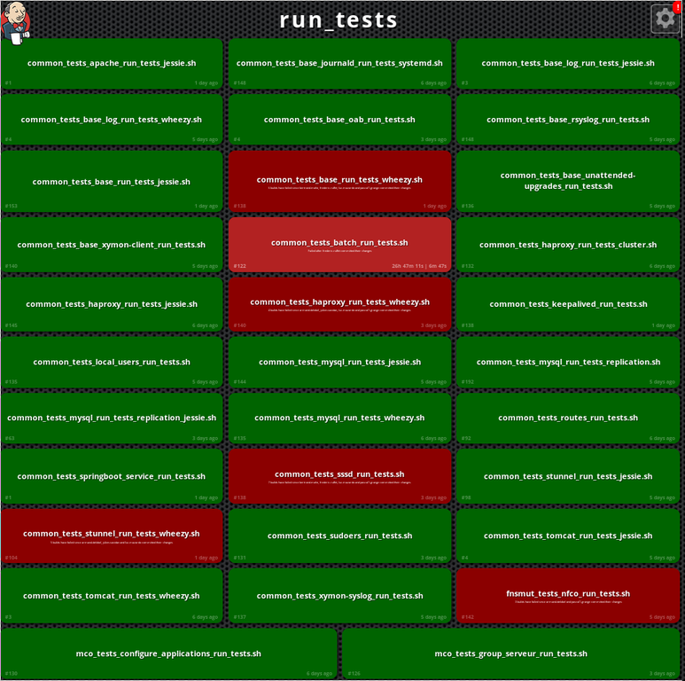

    
    np6         okiwi                   gfi                {epitech}
                          _ _        _                   
               __ _  __ _(_) | ___  | |_ ___  _   _ _ __ 
    Infotel   / _` |/ _` | | |/ _ \ | __/ _ \| | | | '__|
             | (_| | (_| | | |  __/ | || (_) | |_| | |          upwiser
              \__,_|\__, |_|_|\___|  \__\___/ \__,_|_|   
                    |___/                                
            ____                _                         ____   ___  _  __   
           | __ )  ___  _ __ __| | ___  __ _ _   ___  __ |___ \ / _ \/ |/ /_  
           |  _ \ / _ \| '__/ _` |/ _ \/ _` | | | \ \/ /   __) | | | | | '_ \ 
    jet    | |_) | (_) | | | (_| |  __/ (_| | |_| |>  <   / __/| |_| | | (_) |
    brains |____/ \___/|_|  \__,_|\___|\__,_|\__,_/_/\_\ |_____|\___/|_|\___/ 
                                                                                
                    coolworking              neotech
                                             solutions              lectra
    onepoint.
    
    #atbdx

---

---

#_

# Développement guidé par les tests de rôles Ansible

En 2016, installer et configurer un serveur :

* ça s'automatise
* donc ça se code
* donc ça se teste

Nos serveurs sont configurés automatiquement et maintenus grâce à Ansible.

* environ 200 serveurs répartis sur 9 plate-formes différentes
* une trentaine de rôles ansible
* comment modifier un rôle sans avoir peur de casser une autre plate-forme ?

---
# Développement par les tests

* créer un seul test unitaire décrivant un aspect du programme
* s'assurer, en l'exécutant, que ce test échoue pour les bonnes raisons
* écrire juste assez de code, le plus simple possible, pour que ce test passe
* remanier le code autant que nécessaire pour se conformer aux critères de simplicité
* recommencer, en accumulant les tests au fur et à mesure

[[http://institut-agile.fr]](http://institut-agile.fr)

---
# Plomberie

---
# Intégration continue

