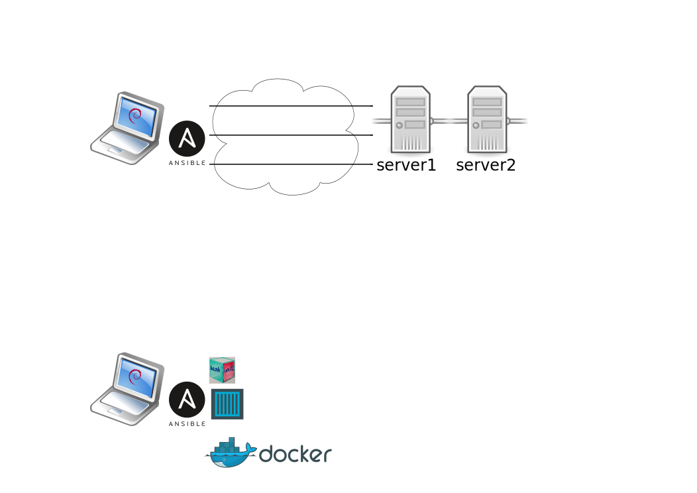

# Développement guidé par les tests de rôles ansible.

---
# intro
> En 2016, installer et configurer un serveur ça s'automatise, 
> donc ça se code, donc ça se teste.

---
# TDD

---
# Plomberie

---
# Intégration continue

