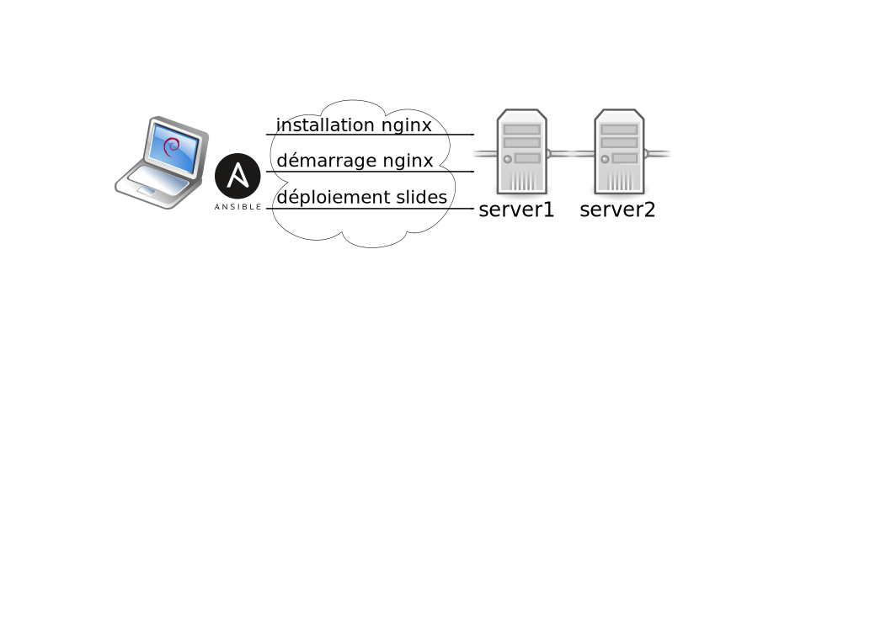

    
    np6         okiwi                   gfi                {epitech}
                          _ _        _                   
               __ _  __ _(_) | ___  | |_ ___  _   _ _ __ 
    Infotel   / _` |/ _` | | |/ _ \ | __/ _ \| | | | '__|
             | (_| | (_| | | |  __/ | || (_) | |_| | |          upwiser
              \__,_|\__, |_|_|\___|  \__\___/ \__,_|_|   
                    |___/                                
            ____                _                         ____   ___  _  __   
           | __ )  ___  _ __ __| | ___  __ _ _   ___  __ |___ \ / _ \/ |/ /_  
           |  _ \ / _ \| '__/ _` |/ _ \/ _` | | | \ \/ /   __) | | | | | '_ \ 
    jet    | |_) | (_) | | | (_| |  __/ (_| | |_| |>  <   / __/| |_| | | (_) |
    brains |____/ \___/|_|  \__,_|\___|\__,_|\__,_/_/\_\ |_____|\___/|_|\___/ 
                                                                                
                    coolworking              neotech
                                             solutions              lectra
    onepoint.
    
    #atbdx

---

# Développement guidé par les tests de rôles Ansible

OAB

---

---
#
* environ 200 serveurs répartis sur 9 plate-formes différentes
* une trentaine de rôles ansible

> En 2016, installer et configurer un serveur ça s'automatise, 
> donc ça se code, donc ça se teste.

---
# TDD
1.
2.
3.

---
# Plomberie
Ansible est lancé dans un containeur. Les tests sont lancés dans ce containeur.
Un script shell initie toute cette infrastructure de test.

---
# Intégration continue

